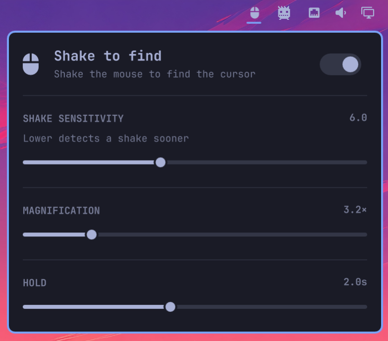

# Shake to find

Omarchy plugin that magnifies the cursor when you shake the mouse, like
macOS.



It wraps [hypr-dynamic-cursors](https://github.com/VirtCode/hypr-dynamic-cursors)
and loads that compositor plugin into Hyprland at runtime. Simulation modes
(tilt / rotate / stretch) are forced off; only shake-to-find zoom is enabled.

It does **not** edit `hyprland.lua` or any other file under `~/.config/hypr/`.
The `.so` is built into `~/.local/state/omarchy/omacursorshake/` and loaded
with `hyprctl`. Settings are re-applied after Hyprland config reloads.

The Omarchy shell starts every login. This plugin rides that process and
re-attaches the compositor plugin each session.

## Install

```bash
omarchy plugin add https://github.com/thinklinux/omacursorshake.git --enable
```

First enable clones and compiles hypr-dynamic-cursors (needs `git`, `make`,
`g++`, and the Hyprland headers that already ship with Omarchy). No sudo.
After that, shake the mouse.

From a local checkout you can instead run `./install.sh`, which symlinks this
folder into `~/.config/omarchy/plugins/` and enables it.

## Use

- Left-click the bar icon for settings
- Middle-click to toggle

The feature stays on while the widget is enabled, even with the panel closed.
Sensitivity, magnification, hold, and the on/off switch are saved in
`~/.local/state/omarchy/omacursorshake/settings.json` and restored on login.

Removing the bar widget disables shake detection. Leave the icon on the bar
if you want it to keep working.

## Verifying the upstream pin

Each supported Hyprland version maps to one hypr-dynamic-cursors commit, taken
from upstream's `hyprpm.toml`. Alongside it this repo records the SHA-256 of
that commit's source tree, and the build refuses to run `make` unless the
checkout hashes to it.

The commit SHA already names the content, but only through git's SHA-1 and only
while the object stays reachable on a branch — upstream publishes no tags and
no releases, so there is nothing immutable to point at. The digest table is
this repo's own attestation of the bytes that were reviewed, in a hash git does
not use, checked against the tree `make` is about to compile.

```bash
bin/verify_pins.py
```

That clones upstream and, for every pin, confirms the commit still resolves and
is reachable, recomputes the digest with the same code the build uses, and
diffs the whole Hyprland-to-plugin map against upstream's `hyprpm.toml`. It
exits non-zero on any drift. `--print` emits a regenerated table.

During a build the source tree is pinned by an open directory descriptor. The
digest, the compiler, and the copy of the finished `.so` all address that one
descriptor, so the tree that is verified is provably the tree that is compiled
— nothing re-resolves the path by name after the check.

### What the build stamp records

`built-for` is a JSON attestation, not just a Hyprland commit: it names the
build-pipeline generation, the Hyprland commit, the pinned upstream commit, the
verified source-tree digest, and the SHA-256 of the installed `.so`.

The plugin reuses an existing binary only when all of that still holds *and*
the file on disk still hashes to the recorded digest, and it re-checks the same
thing immediately before handing the `.so` to Hyprland. Anything that does not
match is rebuilt rather than trusted. A binary produced by an older pipeline —
one that predates source-digest verification — is therefore rebuilt on upgrade
instead of surviving untouched.

## Uninstall

```bash
omarchy plugin remove io.github.thinklinux.omacursorshake
```

That disables the plugin and deletes the checkout. The compiled
hypr-dynamic-cursors binary under `~/.local/state/omarchy/omacursorshake/`
can be deleted too if you want it gone.

## Limits

- x86_64 only (Hyprland function hooks)
- hypr-dynamic-cursors is fetched at a pinned commit for the running Hyprland
  version. Unsupported Hyprland versions fail instead of building `main`.
  The checkout must match that commit, be clean, and hash to the recorded
  SHA-256 of its source tree before anything is compiled.
- A Hyprland update rebuilds the compositor plugin on next login (stamp
  mismatch), as does any change to the recorded pin, the source digest, the
  build-pipeline generation, or the installed binary's own bytes. Do not
  overwrite the mapped `.so` while Hyprland has it loaded.
- Building needs `/proc` mounted and coreutils 8.28+ (`env --chdir`), which is
  how the source tree is pinned by descriptor across the build. The preflight
  fails with that reason rather than falling back to resolving the path by
  name.
- Sensitivity, magnification, and hold are range-checked backend-side against
  the same bounds the sliders enforce. A hand-edited `settings.json` outside
  those bounds is refused rather than passed through to the compositor.
- Only one copy of hypr-dynamic-cursors can be loaded. Hyprland does not report
  plugin paths. If our `.so` is already mapped into this compositor, that is
  treated as proof and the plugin keeps using it. A different copy (typically
  via `hyprpm`) stays unclaimed: run `hyprpm remove hypr-dynamic-cursors` and
  restart the shell.
- Every component of the state path must be a real directory owned by you (or
  root) and must not be group/other writable without the sticky bit. If
  `~/.local` or `~/.local/state` is group writable, `chmod go-w` it; otherwise
  the plugin refuses to read or publish state rather than risk a swapped
  component. The path itself must not contain `[` or `]`.

## License

MIT. See [LICENSE](LICENSE).
